# 🧠 Smart Todo AI

**Your AI-powered productivity hub for intelligent task management.**

➡️ [**View Live on Vercel**](https://smart-todo-ai-five.vercel.app/)

---

## 🧪 Test User Credentials

Use the following test account to explore the app:

```txt
📧 Email: mohammedb4u2@gmail.com  
🔐 Password: mustafaPass

## ✅ Features

* **Smart Task Creation:** AI-driven suggestions for quicker task entry.
* **Auto-Categorization:** Effortlessly organizes your tasks.
* **Weekly Schedule & Time Blocking:** Visualize and plan your time effectively.
* **Task Prioritization:** Focus on what matters most.
* **User Authentication (JWT):** Secure login and registration.
* **Mobile-Responsive UI:** Access your tasks from any device.

---

## 📸 Screenshots

### 🔐 Auth Screens
**Signup**
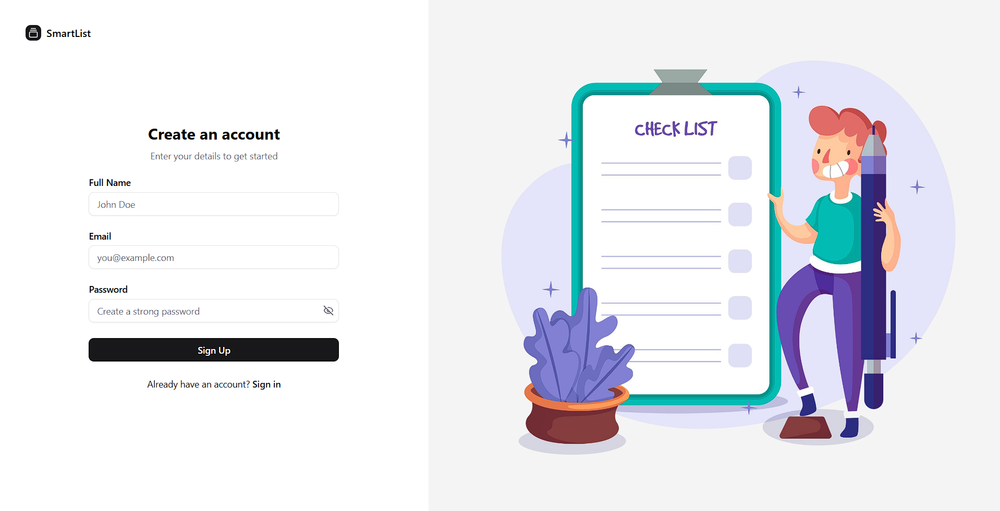

**Login**
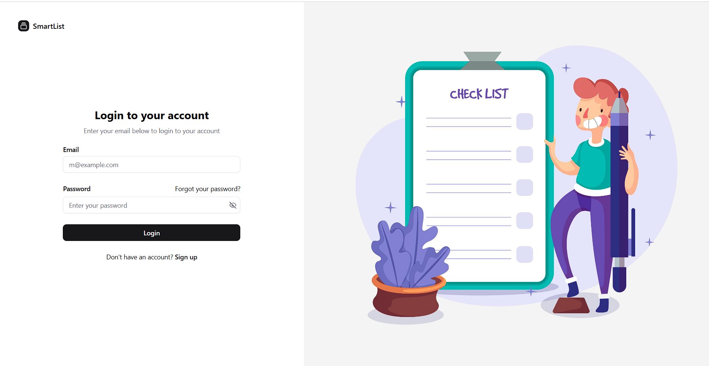

**Forgot Password**
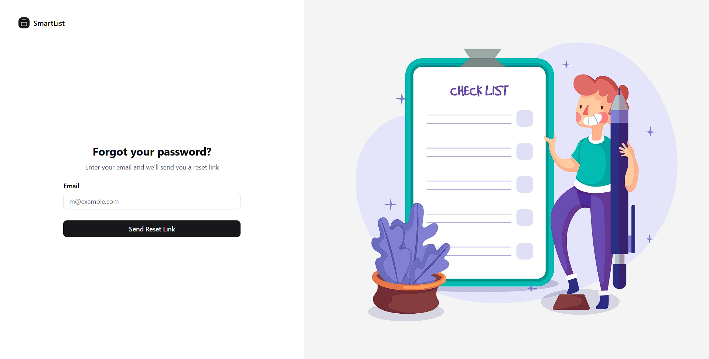

**Email Verification**
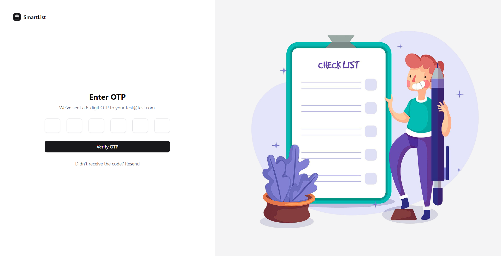

**Reset Password**
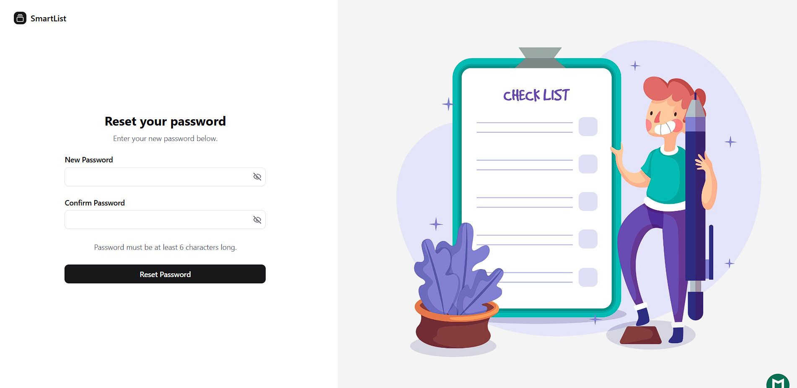

---

### 🧑‍💼 Profile Screens
**Edit Profile**
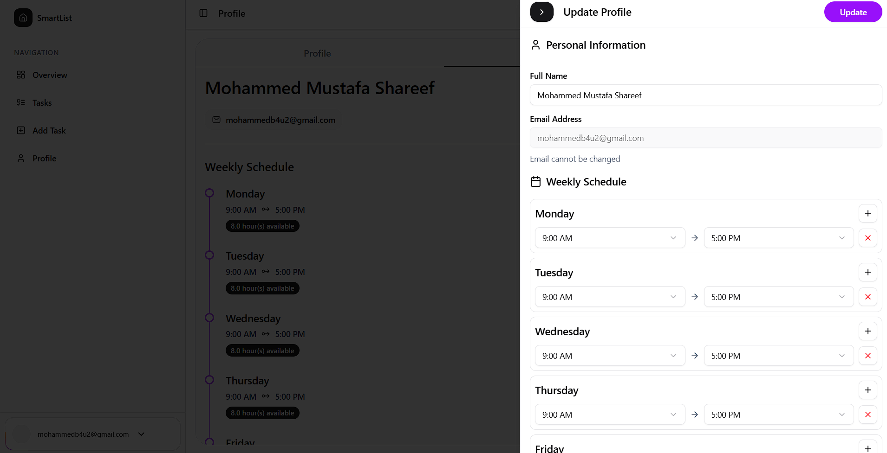

**Change Password**
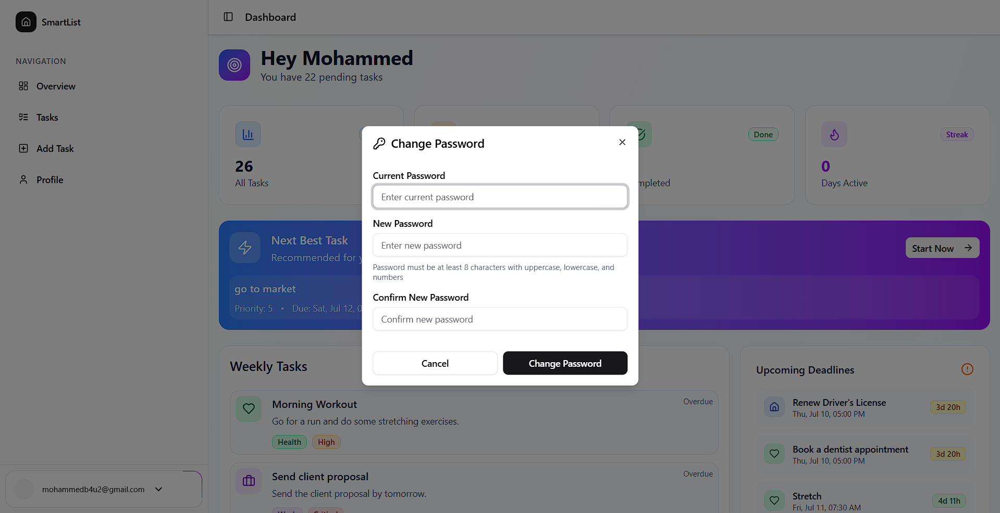

**User Actions**
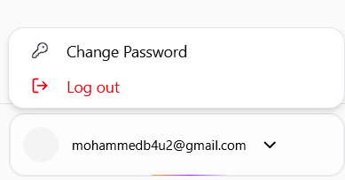

---

### 📅 Task Management Screens
**Dashboard**
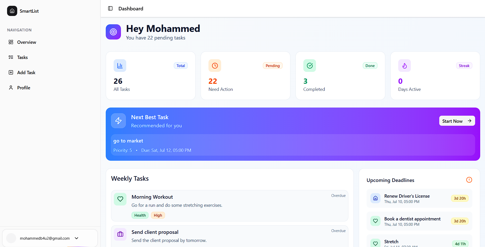

**Dashboard View 2**
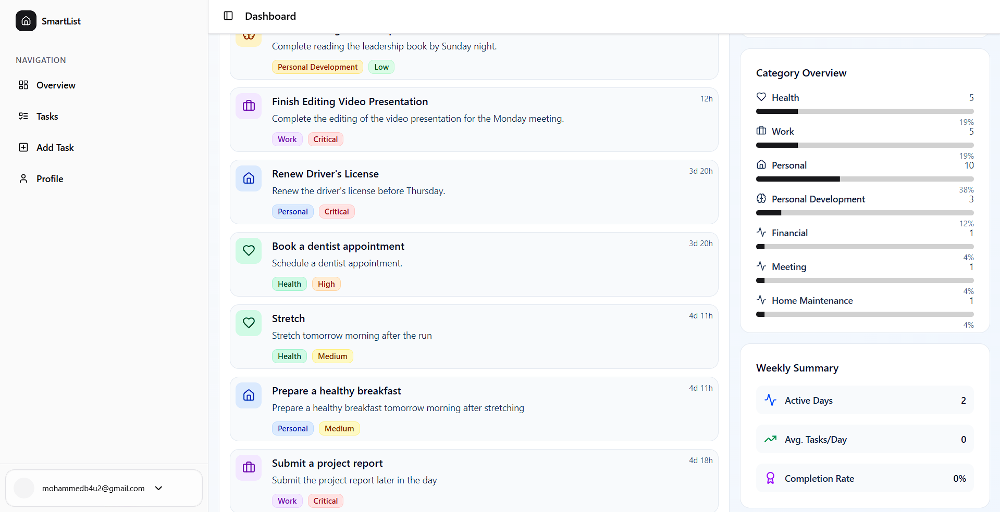

**All Tasks**
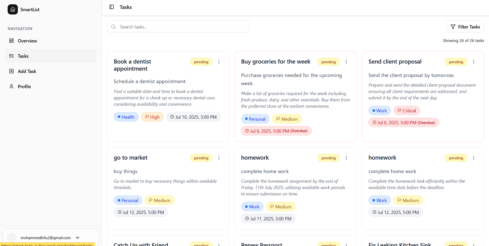

**Filter Tasks**
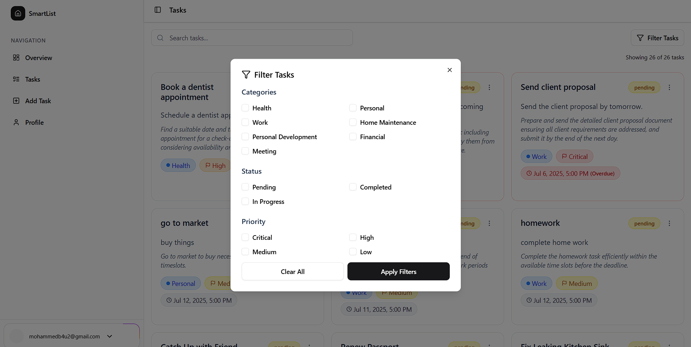

**Task Actions**
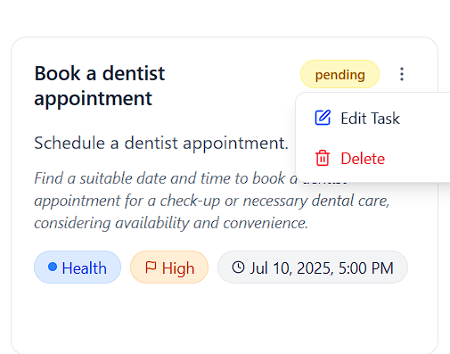

**Add Task**
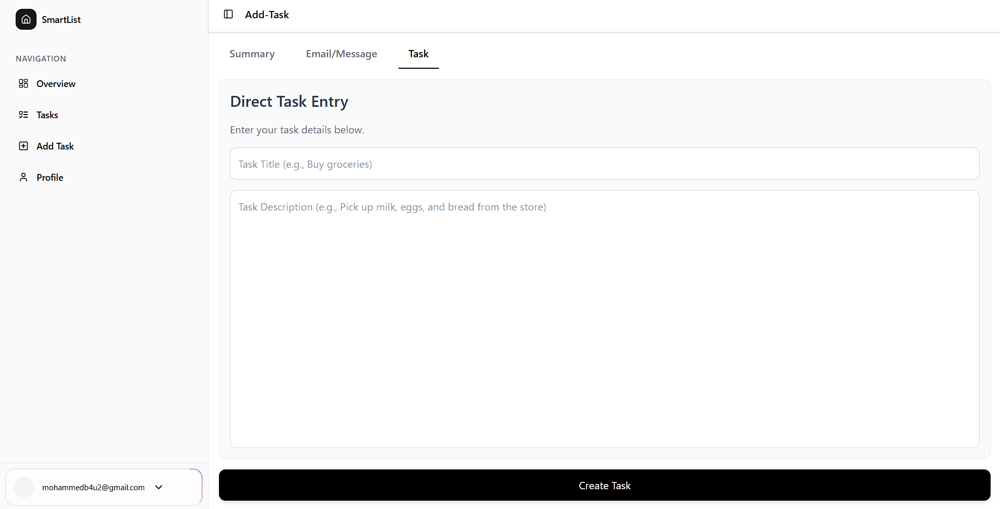

**Add Task with Email or SMS**
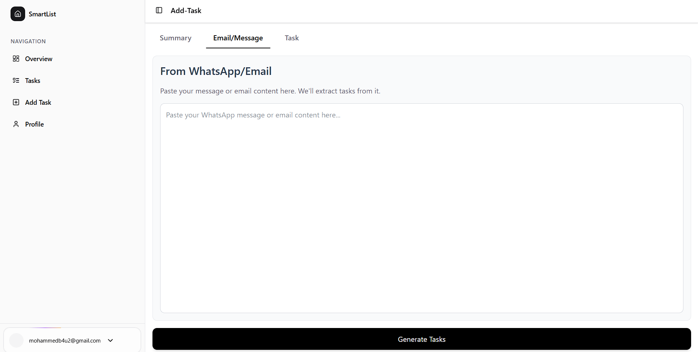

**Add Task with Summary or Voice**
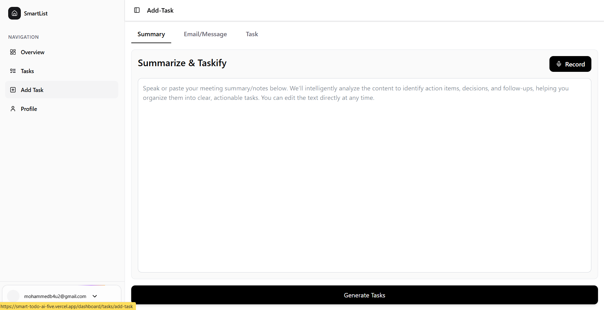

**Edit Task**
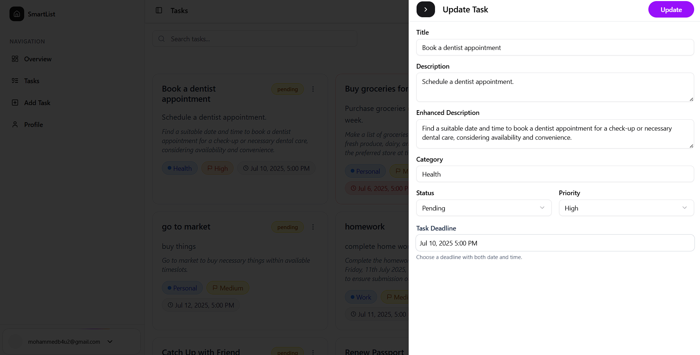

**Delete Task**
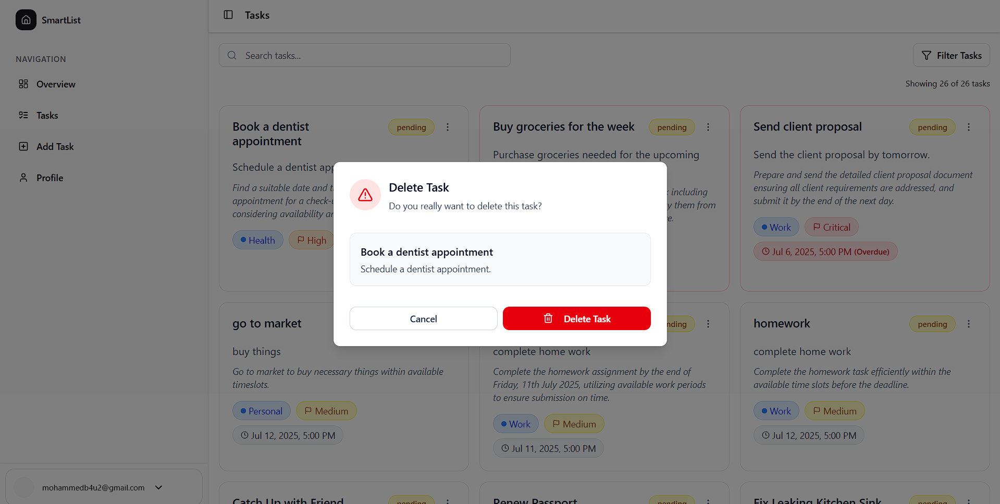

---

## 🧠 AI Capabilities

* **Task Suggestions:** Auto-fills based on input.
* **Smart Reminders & Deadline Detection (WIP):** Future enhancements for proactive task management.

---

## 🛠 Tech Stack

### Backend
* **Python / Django REST Framework**
* **PostgreSQL (via Supabase)**
* **JWT Authentication**

### Frontend
* **Next.js 14 (App Router)**
* **Tailwind CSS**
* **Axios / Context API**

### Deployment
* **Frontend:** Vercel  
* **Backend:** PM2 on Ubuntu VPS with Gunicorn

---

## 🚀 Setup & Development

### Backend


cd backend
python3 -m venv venv
source venv/bin/activate
pip install -r requirements.txt
cp .env.example .env
# Open .env and add your OpenAI API key
# Example:
# OPENAI_API_KEY=your-openai-api-key
python manage.py migrate
python manage.py runserver


### Backend

cd frontend
npm install
## Important:
# Open frontend/apis/variables.js and update the backendUrl constant with your actual backend server URL.
Example:

export const BACKEND_URL = "http://localhost:8000";

npm run dev


